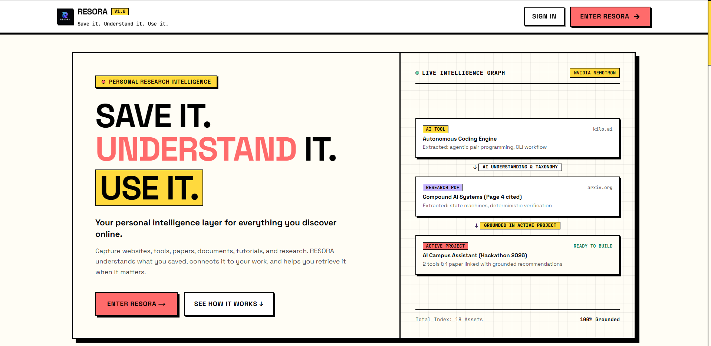

<div align="center">
  

  <br />

  
  <h1>RESORA</h1>
  <p><strong>Personal Research Intelligence</strong></p>
  <p><em>Save it. Understand it. Use it.</em></p>

  <p>
    <a href="#-what-is-resora">About</a> •
    <a href="#-core-capabilities">Capabilities</a> •
    <a href="#-system-architecture">Architecture</a> •
    <a href="#-keyboard-shortcuts">Keyboard Shortcuts</a> •
    <a href="#-quick-start">Quick Start</a> •
    <a href="#-security--data-privacy">Security</a> •
    <a href="#-browser-extension">Extension</a> •
    <a href="#-creator--community">Connect</a>
  </p>

  <p>
    
    
    
    
    
    
    
  </p>
</div>

---

## ⚡ What is RESORA?

Most builders, developers, researchers, founders, and students save high-value resources across dozens of disparate places: browser bookmarks, Twitter bookmarks, Slack messages, Notion tables, and downloaded PDFs. Over time, these become graveyard folders where information is saved but never found when actually needed.

**RESORA** solves this by turning scattered research into compound knowledge organized around what you are actively building.

It is **NOT** a generic bookmark manager, and it is **NOT** a generic ChatGPT wrapper. RESORA is a grounded personal intelligence platform that structures, cross-connects, and retrieves your saved research with exact provenance.

```
CAPTURE                     INTELLIGENCE                   ORGANIZATION                   SYNTHESIS
[ Web / Extension ]              │                              │                              │
[ PDF / Text Docs ] ──────▶ [ Metadata & Ingestion ] ──────▶ [ Workspaces & Stacks ] ─────▶ [ Ask Resora (RAG) ]
[ Mobile / REST API ]            │ (Anti-SSRF & Magic Bytes)    │ (Zero Duplication)           │ (Page-Level Citations)
```

---

## 🚀 Core Capabilities

### 1. High-Velocity Capture & Ingestion
- **1-Click Web Capture**: Save articles, GitHub repos, technical documentation, tools, and social posts.
- **Manifest V3 Browser Extension**: Native extension popup for Chromium browsers and Firefox (`public/extension/`).
- **REST Quick Capture API**: Secure `/api/capture` endpoint for mobile shortcuts, CLI tools, and automation hooks.
- **Smart Canonical URL Normalization**: Automatically strips tracking parameters (`utm_*`, `fbclid`, `gclid`), detects source types, and checks for existing duplicates before indexing.
- **100% Real-Time Deduplication**: Automatic detection and instant deduplication across your entire library.

### 2. Document Intelligence & Page-Level Ingestion
- **PDF & File Streaming Extraction**: Page-aware text extraction for PDF whitepapers, markdown docs, and text files.
- **Magic Byte Signature Verification**: Validates binary headers (`%PDF-` / `0x25 0x50 0x44 0x46 0x2D`) to prevent spoofed uploads.
- **SHA-256 Cryptographic Hashing**: Prevents duplicate document storage through content hash matching.
- **In-Browser Document Reader**: Deep page-by-page reader modal with keyword highlighting and text search.

### 3. Project Workspaces & Curated Collections
- **Contextual Project Workspaces**: Organize resources by build objectives (Hackathons, SaaS builds, Research, Freelance).
- **Curated Collections**: Thematic clusters of tools, libraries, and frameworks for rapid retrieval and cross-project reuse.
- **Zero-Duplication Data Model**: Resources are referenced across projects without copying or fragmenting records.
- **Explainable AI Recommendations**: Resora automatically matches relevant saved research to active project objectives with transparent scoring reasons.
- **Decision Logs & Architectural Notes**: Keep a persistent audit trail of technical decisions linked to specific resources.

### 4. Grounded AI Research Assistant ("Ask Resora")
- **Strict Library Grounding**: The assistant synthesizes answers exclusively from your saved resources and document pages.
- **Zero Hallucination Policy**: If your library does not contain relevant research, Resora clearly admits: *"I couldn't find enough information about that in your saved library."*
- **Multi-Scope Retrieval**: Ground queries across `Entire Library`, `Current Project`, `Current Collection`, `Documents Only`, `Developer Tools`, or `Favorites`.
- **Page-Level Interactive Citations**: Answers reference `[Source 1]`, `[Source 2]` with exact PDF page numbers that deep link directly into the Document Reader.
- **Deterministic Synthesis Fallback**: When an external AI provider API key is omitted, Resora generates structured comparison tables and grounded synthesis deterministically.

---

## ⌨️ Keyboard Shortcuts & Quick Actions

RESORA includes a system of high-velocity keyboard shortcuts accessible from anywhere in the application:

| Shortcut | Key Action | Scope |
| :--- | :--- | :--- |
| <kbd>⌘</kbd> + <kbd>K</kbd> / <kbd>Ctrl</kbd> + <kbd>K</kbd> | **Command Palette / Quick Actions** | Global |
| <kbd>⌘</kbd> + <kbd>Shift</kbd> + <kbd>S</kbd> / <kbd>Ctrl</kbd> + <kbd>Shift</kbd> + <kbd>S</kbd> | **Quick Capture Modal** | Global |
| <kbd>Escape</kbd> | **Close Any Modal / Command Palette / Viewer** | Global |
| <kbd>L</kbd> | **Navigate to Library** | When Palette / Quick Bar is Active |
| <kbd>P</kbd> | **Navigate to Project Workspaces** | When Palette / Quick Bar is Active |
| <kbd>A</kbd> | **Open Ask Resora AI Assistant** | When Palette / Quick Bar is Active |
| <kbd>D</kbd> | **Open Documents & Research** | When Palette / Quick Bar is Active |
| <kbd>T</kbd> | **Open Developer Tools** | When Palette / Quick Bar is Active |
| <kbd>C</kbd> | **Open Curated Collections** | When Palette / Quick Bar is Active |
| <kbd>I</kbd> | **Open Inbox** | When Palette / Quick Bar is Active |
| <kbd>F</kbd> | **Open Starred Favorites** | When Palette / Quick Bar is Active |

---

## 🔒 Security & Data Privacy

Resora was built from the ground up for privacy-conscious researchers:

- **SSRF Defense Firewall (`src/lib/security/ssrf.ts`)**:
  - Restricts protocols strictly to `http:` and `https:`.
  - Blocks loopback (`127.0.0.1`), private RFC 1918 subnets (`10.0.0.0/8`, `172.16.0.0/12`, `192.168.0.0/16`), AWS/GCP cloud metadata (`169.254.169.254`), and internal suffixes (`.local`, `.internal`).
  - Follows redirects securely, verifying that redirected target destinations remain within safe public boundaries.
- **Upload Hardening**:
  - Strict 25MB ceiling and 300 page limits.
  - Rejects executable extensions (`.exe`, `.bat`, `.cmd`, `.sh`, `.php`, `.js`, `.py`, `.dll`).
- **Prompt Injection Defense**:
  - Retrieved library content is treated as untrusted data and strictly encapsulated inside `<library_context>` fences.
  - The assistant is structurally prohibited from performing autonomous destructive actions.
- **Data Portability & Account Deletion**:
  - Complete JSON and CSV data export in one click.
  - Browser bookmark HTML import with automatic duplicate skipping.
  - Permanent account deletion with cascading cleanup across resources, vectors, documents, and conversations.

---

## 🛠️ Tech Stack

| Layer | Technology | Purpose |
| :--- | :--- | :--- |
| **Framework** | [Next.js 16.3.4 (Turbopack)](https://nextjs.org/) | App Router, Server Components, Route Handlers |
| **Runtime & UI** | [React 19](https://react.dev/), [TypeScript 5](https://www.typescriptlang.org/) | Strict typing, concurrent features, modern React |
| **Styling** | [Tailwind CSS v4](https://tailwindcss.com/) | Neo-Brutalist high-contrast visual system |
| **Icons & Typography** | [Lucide React](https://lucide.dev/), Inter, JetBrains Mono | Production icons and monospace accents |
| **Database & Auth** | [Supabase](https://supabase.com/) (PostgreSQL + RLS) | Relational persistence, Row-Level Security, pgvector |
| **AI & Inference** | OpenAI API / Local Deterministic Engine | Semantic synthesis, structured taxonomy extraction |
| **Extension** | WebExtensions Manifest V3 | Cross-browser 1-click capture |

---

## 🏁 Quick Start

### 1. Prerequisites
- **Node.js**: v18.18.0 or newer (Node 20+ recommended)
- **npm** or **pnpm**

### 2. Installation
```bash
# Clone repository
git clone https://github.com/Ashwinnethan64-maker/resora.git
cd resora

# Install dependencies
npm install
```

### 3. Environment Setup
Copy the environment template:
```bash
cp .env.example .env.local
```

Configure your `.env.local` settings:
```env
# Application URL
NEXT_PUBLIC_APP_URL=http://localhost:3000

# Supabase Auth & Database (Official SSR Architecture)
NEXT_PUBLIC_SUPABASE_URL=https://your-project.supabase.co
NEXT_PUBLIC_SUPABASE_ANON_KEY=your-anon-key
SUPABASE_SERVICE_ROLE_KEY=your-service-role-key

# NVIDIA AI Intelligence Provider
NVIDIA_API_KEY=your-nvidia-key
NVIDIA_BASE_URL=https://integrate.api.nvidia.com/v1
NVIDIA_TEXT_MODEL=nvidia/nemotron-3-ultra-550b-a55b
```

### 4. Supabase & Google OAuth Configuration
1. Go to your **Supabase Dashboard** -> **Authentication** -> **Providers** -> **Google**.
2. Enable Google provider and paste your Google Cloud **Client ID** and **Client Secret**.
3. In your **Google Cloud Console** (OAuth 2.0 Client Credentials), add the Authorized Redirect URI:
   `https://<your-project-id>.supabase.co/auth/v1/callback`
4. Apply database migrations:
   Run `supabase/migrations/20260908_auth_profiles.sql` in the Supabase SQL Editor.

### 5. Run Development Server
```bash
npm run dev
```
Open [http://localhost:3000](http://localhost:3000) to view the application.

### 6. Production Build Verification
```bash
npm run build
npm run start
```

---

## 🧩 Browser Extension Setup

RESORA includes a ready-to-use Manifest V3 browser extension located in `public/extension/`:

1. Open **Chrome** or **Edge** and navigate to `chrome://extensions/`.
2. Toggle **Developer mode** on (top right).
3. Click **Load unpacked** and select the `public/extension` folder.
4. The RESORA icon will appear in your browser toolbar. Clicking it allows 1-click capturing of any active webpage into your library!

---

## 📂 Project Structure

```
RESORA web/
├── public/
│   ├── Resora_banner.png   # Official RESORA presentation banner
│   ├── Resora_logo.ico     # Official RESORA brand asset
│   ├── Resora_logo.png     # High-resolution PNG mark
│   ├── manifest.json       # PWA Web App Manifest
│   └── extension/          # Manifest V3 browser extension
│       ├── manifest.json
│       ├── popup.html
│       └── popup.js
├── src/
│   ├── app/
│   │   ├── api/            # Route handlers (AI, Assistant, Capture, Documents, Metadata)
│   │   ├── app/            # Authenticated workspace routes (Library, Projects, Collections, etc.)
│   │   ├── auth/           # Authentication portal (Sign In, Sign Up, Reset)
│   │   ├── privacy/        # Privacy policy transparency
│   │   ├── terms/          # Terms of service
│   │   ├── layout.tsx      # Root layout, metadata icons, font definitions
│   │   ├── error.tsx       # Global React Error Boundary
│   │   └── not-found.tsx   # Branded 404 handler
│   ├── components/
│   │   ├── assistant/      # SourceCards, chat components
│   │   ├── brand/          # ResoraLogo, NeoSticker components
│   │   ├── documents/      # PDF Dropzone, In-browser Document Reader
│   │   ├── layout/         # AppShell, Navigation Sidebar, Header, CommandPalette
│   │   ├── onboarding/     # First-run onboarding modal
│   │   └── resources/      # Resource cards, save dialogs, filter bars
│   ├── context/            # ResoraContext (Reactive local & remote state)
│   ├── lib/
│   │   ├── assistant/      # Chunking service, hybrid retrieval, prompt fences
│   │   ├── auth/           # AuthService session manager
│   │   ├── documents/      # PDF streaming extractor, magic byte verifier
│   │   ├── security/       # SSRF firewall, input sanitizers
│   │   └── services/       # ResourceService CRUD & recommendation engine
│   └── types/              # Database models, RAG types, and schemas
└── supabase/
    └── migrations/         # PostgreSQL DDL, RLS policies, pgvector indexes
```

---

## 🤝 Creator & Community

Follow the build, contribute, or connect:

- **GitHub Repository**: [https://github.com/Ashwinnethan64-maker/resora.git](https://github.com/Ashwinnethan64-maker/resora.git)
- **LinkedIn / Creator**: [Ashwin Nethan](https://www.linkedin.com/in/ashwin-nethan-a59259366/)

---

## 📖 Deep-Dive Documentation

- 📐 [Architecture & System Design](ARCHITECTURE.md)
- 📋 [Production Launch Checklist](PRODUCTION_CHECKLIST.md)
- 🗄️ [Database Migrations](supabase/migrations/)

---

## 📄 License

Distributed under the MIT License. See `LICENSE` for details.
